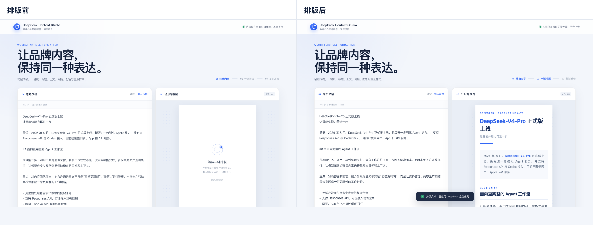

# 飞书文档最小展示内容（可直接复制）

> 使用方法：把下面“可直接复制”的整段内容粘贴到飞书文档，再把 `demo/compare.png`（或 `demo/01-input.png`、`demo/02-output.png`）拖进文档对应位置即可。

---

## 可直接复制

**DeepSeek Content Studio｜品牌公众号排版器**

一款为品牌公众号设计的排版工具：把写好的文章文字粘贴进去，一键生成固定品牌风格（标题、正文、间距、配色、重点样式），排好后直接复制到公众号使用。

核心能力：

- 自动识别标题、章节、导语、正文、列表、引用、重点卡片；
- 375px 公众号宽度预览，品牌样式固定，不依赖外部样式表；
- 一键复制富文本，粘贴到公众号编辑器后样式保留；
- 全部在浏览器本地完成，内容不上传。

代码仓库：<https://github.com/Icewinc/deepseek-wechat-formatter>

本地运行：

```bash
npm ci
npm run dev
```

浏览器打开 http://localhost:3000/ 即可体验。



说明：本页面为独立演示项目，与 DeepSeek 官方无隶属或授权关系。

---

## 飞书排版建议

1. 粘贴上面的整段文字；
2. 在“核心能力”列表后插入 `demo/compare.png`（推荐，单张对比图）；
3. 如需更完整效果，可再插入 `demo/01-input.png` 与 `demo/02-output.png`；
4. 仓库目前是私有仓库：如果对方需要直接打开链接，请先把仓库设为公开，或为对方生成协作者邀请。
